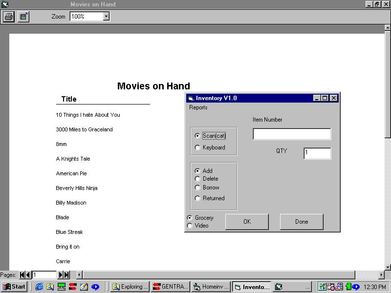



## HomeInventory

### Description

This is an Home Inventory program that uses the cuecat that was given out by Radio Shack. It also show ADO connections Data Reports. You can keep track of your movies, what you have and who borrowed them as well if you sold any. You can scan or key in the UPC from movies as well as groceries. This still needs a little work, but I am on the right track.
 
### More Info
 

             |
---                |---
**Submitted On**   |2001-12-13 12:31:20
**By**             |[Chris Scarberry](https://github.com/Planet-Source-Code/PSCIndex/blob/master/ByAuthor/chris-scarberry.md)
**Level**          |Beginner
**User Rating**    |4.7 (14 globes from 3 users)
**Compatibility**  |VB 6\.0
**Category**       |[Databases/ Data Access/ DAO/ ADO](https://github.com/Planet-Source-Code/PSCIndex/blob/master/ByCategory/databases-data-access-dao-ado__1-6.md)
**World**          |[Visual Basic](https://github.com/Planet-Source-Code/PSCIndex/blob/master/ByWorld/visual-basic.md)
**Archive File**   |[HomeInvent4176112132001\.zip](https://github.com/Planet-Source-Code/chris-scarberry-homeinventory__1-29741/archive/master.zip)

